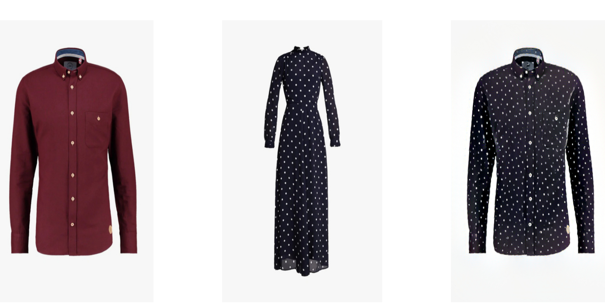
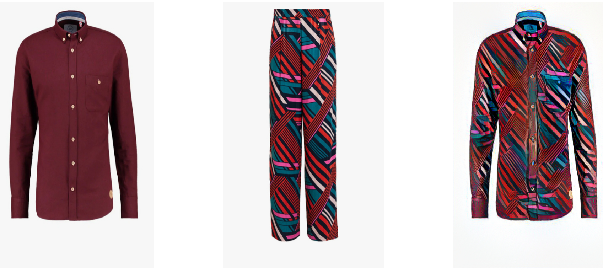
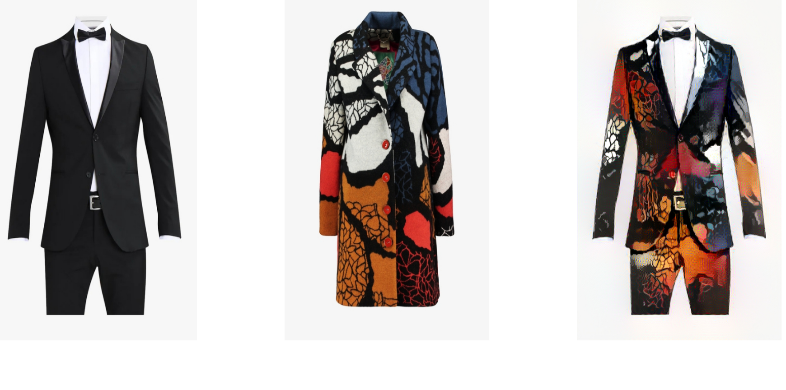
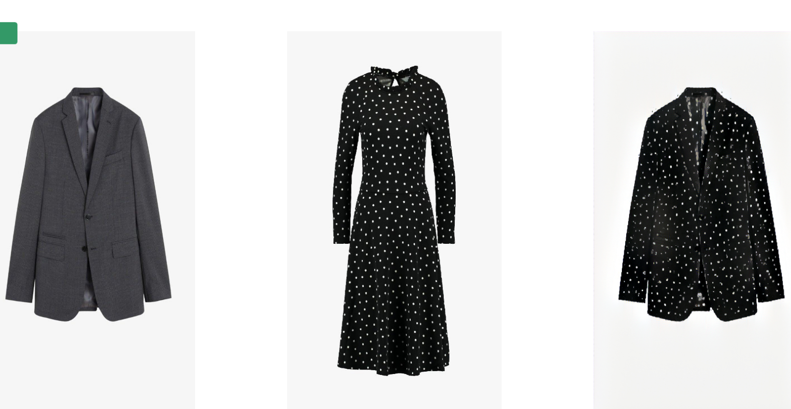

# Dress Generator

A deep learning algorithm to generate new dresses

# Dependencies
<ul>
 <li>Python 3.6+</li>
 <li>Matlab</li>
 <li>Tensorflow version 1.14 </li> 
 <li>Cuda toolkit 10.0</li>
  <li>Cudnn</li>
 
 <li> Pretrained VGG-19 Model<li>
<li><ol type="a">
 <li>VGG-19 Model: http://www.vlfeat.org/matconvnet/models/imagenet-vgg-verydeep-19.mat.</li>

<li>After downloading, put it in the top level of this repository.</li></ol></li>
</ul>

# Instructions for usage
<ul>
<li>install the dependencies properly and clone the repository</li>
<li>navigate into guided-neural-style-transfer folder</li>
<li>open terminal there</li>
 <li>Type command <b>python webtojpg.py</b></li>
</ul>

# Results
## Content      &nbsp;&nbsp;&nbsp;&nbsp;&nbsp;&nbsp;&nbsp;&nbsp;&nbsp;&nbsp;&nbsp;&nbsp;&nbsp;&nbsp;&nbsp;&nbsp;&nbsp;&nbsp;&nbsp;&nbsp;&nbsp;&nbsp;&nbsp;&nbsp;&nbsp;&nbsp;&nbsp;&nbsp;&nbsp;&nbsp;&nbsp;&nbsp;&nbsp;&nbsp;&nbsp;&nbsp;         Style    &nbsp;&nbsp;&nbsp;&nbsp;&nbsp;&nbsp;&nbsp;&nbsp;&nbsp;&nbsp;&nbsp;&nbsp;&nbsp;&nbsp;&nbsp;&nbsp;&nbsp;&nbsp;&nbsp;&nbsp;&nbsp;&nbsp;&nbsp;&nbsp;&nbsp;&nbsp;&nbsp;&nbsp;&nbsp;&nbsp;         Generated Dress








# This github code is based on the code written by below authors
## Credits 
```
@misc{Wang2017,
  author = {Wang, Zirui},
  title = {guided-neural-style},
  year = {2017},
  publisher = {GitHub},
  journal = {GitHub repository},
  howpublished = {\url{https://github.com/wzirui/guided-neural-style}},
}
```
